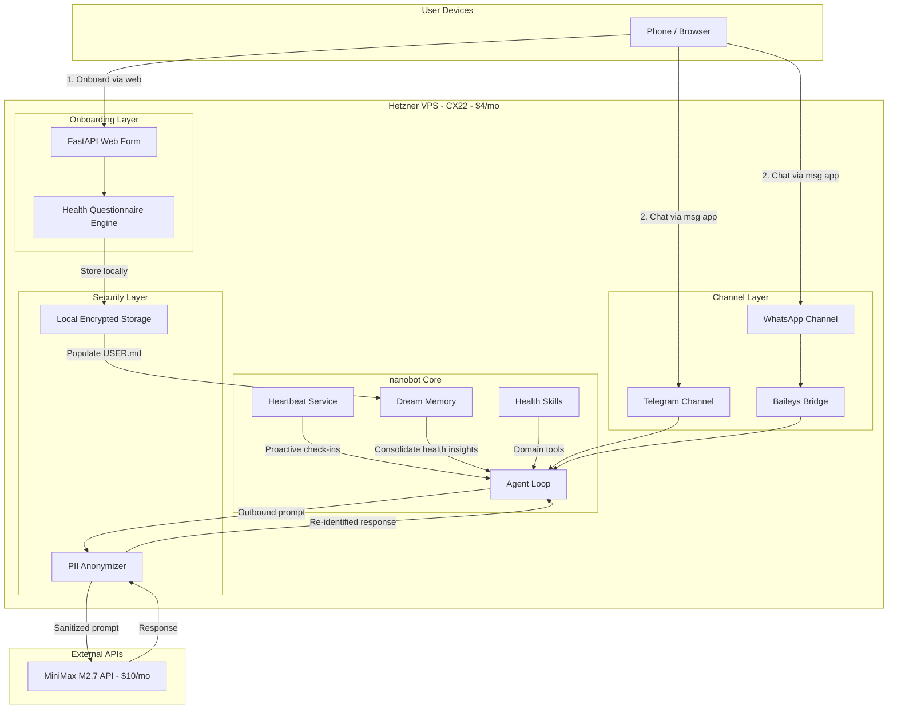

# Health AI Assistant V1 -- Implementation Plan

## Why nanobot (not OpenClaw)

nanobot is the right base for this product. It is a 4,000-line Python reimplementation of OpenClaw's core with:

- **MiniMax provider already registered** in `[nanobot/providers/registry.py](nanobot/providers/registry.py)` (line 275-282) with `default_api_base="https://api.minimax.io/v1"`
- **Telegram + WhatsApp channels** already working (`[nanobot/channels/telegram.py](nanobot/channels/telegram.py)`, `[nanobot/channels/whatsapp.py](nanobot/channels/whatsapp.py)` + Node bridge in `[bridge/](bridge/)`)
- **Heartbeat service** for proactive engagement (`[nanobot/heartbeat/service.py](nanobot/heartbeat/service.py)`) -- wakes every 30min, checks tasks, decides whether to reach out
- **Dream memory system** with layered long-term memory (`[docs/MEMORY.md](docs/MEMORY.md)`) -- `SOUL.md`, `USER.md`, `MEMORY.md`, `history.jsonl`, git-versioned
- **Skills system** for extensibility (`[nanobot/skills/](nanobot/skills/)`)
- **Docker deployment** ready (`[Dockerfile](Dockerfile)`, `[docker-compose.yml](docker-compose.yml)`)
- **~100MB RAM** vs OpenClaw's ~1GB -- fits a $4-10/month VPS easily

OpenClaw (430K lines, Node.js, 1GB RAM) is overkill for a single-user health assistant and would eat the entire VPS budget.

---

## Architecture




---

## Data Flow and Security Model

All user health data stays on the VPS. The only data leaving the server is **anonymized conversation context** sent to MiniMax M2.7.

**Anonymization pipeline** (new module: `nanobot/security/anonymizer.py`):

1. **Inbound**: User message arrives via Telegram/WhatsApp
2. **PII Detection**: Regex + pattern matching identifies names, dates of birth, addresses, phone numbers, email, medical record numbers (the 18 HIPAA identifiers)
3. **Tokenization**: Replace PII with reversible tokens (e.g., `John Smith` -> `[PERSON_001]`, `123 Oak St` -> `[ADDR_001]`)
4. **LLM Call**: Send anonymized prompt to MiniMax M2.7
5. **De-tokenization**: Replace tokens back in LLM response before sending to user
6. **Local storage**: Original data stored only on VPS in `~/.nanobot/workspace/` (never transmitted)

This hooks into the existing provider layer at `[nanobot/providers/base.py](nanobot/providers/base.py)` -- wrap the `chat_with_retry` method.

---

## Component Breakdown

### 1. Web Onboarding Form

A lightweight FastAPI app served from the same VPS. Two-phase questionnaire:

**Phase 1 -- Pre-determined (general)**:

- Name, age, gender, height, weight
- Known conditions (diabetes, hypertension, etc. -- checklist)
- Current medications
- Allergies
- Lifestyle (exercise frequency, sleep hours, diet type)
- Preferred messaging channel (Telegram / WhatsApp)

**Phase 2 -- Dedicated (health assessment)**:

- Mental health screening (PHQ-2 style: 2-3 questions)
- Physical activity assessment (simple scale)
- Nutrition habits
- Sleep quality
- Stress level
- Health goals (weight management, fitness, chronic disease management, etc.)
- Any current symptoms or concerns (free text)

**Output**: Generates a `USER.md` health profile in the nanobot workspace + saves structured JSON to `~/.nanobot/workspace/health/profile.json`.

**Tech**: FastAPI + Jinja2 templates, mobile-responsive CSS (Pico CSS or similar minimal framework -- no npm/build step needed). Served on port 443 with Let's Encrypt via Caddy reverse proxy.

### 2. PII Anonymizer Module

New file: `[nanobot/security/anonymizer.py](nanobot/security/anonymizer.py)`

- `PIIAnonymizer` class with `anonymize(text) -> (anonymized_text, token_map)` and `deanonymize(text, token_map) -> original_text`
- Pattern-based detection for: names (from USER.md), dates, phone numbers, emails, addresses, SSN patterns, medical record numbers
- User-specific dictionary loaded from onboarding data (knows the user's name, address, etc.)
- Integrated as middleware in the agent loop -- wraps messages before they hit the provider

### 3. Health Skills

New skill directory: `nanobot/skills/health/SKILL.md`

The health skill instructs the agent to:

- Interpret health data from the user profile
- Provide evidence-based health information (not medical advice -- clear disclaimers)
- Track symptoms over time using MEMORY.md
- Suggest lifestyle adjustments based on goals
- Recognize emergency language and direct to emergency services
- Never diagnose or prescribe

Additional skill: `nanobot/skills/health-checkin/SKILL.md` -- templates for proactive check-in conversations.

### 4. Proactive Health Check-ins (Heartbeat)

Customize `[nanobot/templates/HEARTBEAT.md](nanobot/templates/HEARTBEAT.md)` for health:

- Morning wellness check-in (mood, sleep quality, symptoms)
- Medication reminders (if applicable, from profile)
- Weekly health summary
- Gentle activity nudges based on goals

The existing heartbeat service (30-min interval) evaluates whether to reach out. The LLM decides based on HEARTBEAT.md tasks + time of day + user timezone whether a check-in is appropriate -- this prevents disturbing the user.

### 5. Long-Term Memory for Health

Leverage the existing Dream system (`[nanobot/agent/memory.py](nanobot/agent/memory.py)`):

- **SOUL.md**: Health assistant personality -- empathetic, non-judgmental, evidence-based, never diagnoses
- **USER.md**: Health profile from onboarding + evolving preferences discovered through conversation
- **MEMORY.md**: Ongoing health patterns, symptom trends, medication adherence, mood patterns
- **history.jsonl**: Raw conversation summaries for Dream to process

Dream runs every 2 hours, consolidating health conversations into durable knowledge. Over time, the assistant builds an increasingly accurate health picture.

### 6. Self-Improvement Mechanism

The Dream system naturally enables self-improvement:

- Dream edits SOUL.md to refine communication style based on what works with each user
- Dream updates USER.md as health status changes
- Dream tracks patterns in MEMORY.md (e.g., "user reports headaches every Monday" -> correlate with sleep/stress patterns)

Add a periodic "health insight" Dream task that synthesizes trends from MEMORY.md into actionable observations.

---

## Infrastructure and Cost


| Component       | Choice                                    | Cost/mo  |
| --------------- | ----------------------------------------- | -------- |
| LLM             | MiniMax M2.7 Starter Plan (1500 req/5hrs) | $10      |
| VPS             | Hetzner CX22 (2 vCPU, 4GB RAM, 40GB SSD)  | ~$4      |
| Domain + SSL    | Caddy with Let's Encrypt (free)           | $0       |
| WhatsApp Bridge | Self-hosted Baileys (no API fees)         | $0       |
| Telegram Bot    | Free BotFather API                        | $0       |
| **Total**       |                                           | **~$14** |


This leaves $6 buffer under the $20 budget for DNS/domain costs or scaling.

**Hetzner CX22** is the best fit: 4GB RAM handles nanobot (~~100MB) + Node bridge (~~50MB) + FastAPI onboarding (~~30MB) + Caddy (~~20MB) with room to spare. European data centers provide good latency and strong data protection (GDPR).

---

## Deployment

- **Caddy** as reverse proxy: handles HTTPS, routes `/onboard` to FastAPI (port 8080), gateway API internally on port 18790
- **Docker Compose** extends existing `[docker-compose.yml](docker-compose.yml)`: adds `onboarding` service + `caddy` service
- **systemd** or Docker restart policy for 24/7 uptime
- Existing `[Dockerfile](Dockerfile)` already handles nanobot + Node bridge

---

## MiniMax M2.7 Configuration

In `~/.nanobot/config.json`:

```json
{
  "agents": {
    "defaults": {
      "model": "minimax/minimax-m2.7",
      "provider": "minimax",
      "contextWindowTokens": 65536,
      "maxTokens": 4096,
      "temperature": 0.3,
      "dream": { "intervalH": 2, "modelOverride": null }
    }
  },
  "providers": {
    "minimax": { "apiKey": "ENV:MINIMAX_API_KEY" }
  }
}
```

MiniMax M2.7 specs: 205K context window, $0.30/M input tokens, $1.20/M output tokens, 47 tok/s. The $10 Starter plan gives 1500 requests per 5-hour window -- sufficient for a single-user health assistant with heartbeat check-ins.

---

## Product Pricing Justification ($50/user)

- Operating cost per user: ~$14-20/month
- Gross margin: $30-36/month per user
- Value proposition: Always-on, secure, long-memory health AI that learns and improves -- no app to install, works on existing messaging apps, onboards in 5 minutes

---

## What V1 Does NOT Include (Future Versions)

- Apple Health / Google Fit integration
- Voice messages / transcription
- Multi-user per instance (V1 is 1 VPS = 1 user)
- Web dashboard for health trends visualization
- HIPAA BAA compliance (V1 uses best-effort anonymization, not certified)
- Payment/billing system

